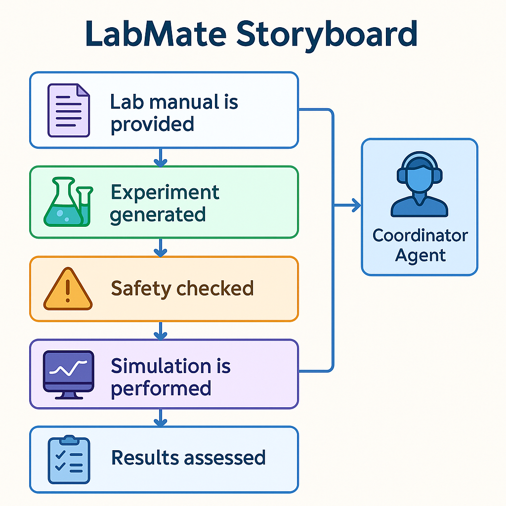

---

# 🧪 **VirtuLab-AI**

An intelligent, multi-agent virtual laboratory system that automates experiment generation, simulation, evaluation, safety checks, and student interaction. This project aims to modernize engineering education by enabling students to perform laboratory experiments digitally using AI-driven agents.

---

## 📌 **Description**

**VirtuLab-AI** is a modular, agent-based virtual laboratory platform designed to simulate real-world lab experiments.
Each agent has a dedicated role—such as coordinating workflows, generating experiments, verifying safety, ingesting data, simulating results, grading outputs, and interacting with students through a chat interface.

This system helps institutions offer scalable and interactive lab sessions without requiring physical laboratory resources.

---

## 🚀 **Features**

* 🔹 **Multi-Agent Architecture** for full automation
* 🔹 **Experiment Generator** for creating experiment tasks
* 🔹 **Simulation Agent** for performing calculations and plotting outputs
* 🔹 **Safety Agent** to check experimental feasibility
* 🔹 **Grader Agent** for evaluating student submissions
* 🔹 **Chat Agent** for user interaction
* 🔹 **Coordinator** to manage workflows
* 🔹 **PDF Tool & Codegen Tool** for generating documentation
* 🔹 **Sample RC Circuit Experiment Included**
* 🔹 **Clean folder structure with tools, agents & docs**

---

## 🛠️ **Tech Stack**

* **Python 3**
* **AI Agent Architecture**
* **Matplotlib** (for simulation plots)
* **Custom Tools (PDF tool, Codegen tool, Simulator tool)**

---

## 📂 **Folder Structure**

```
VirtuLab-AI-main/
│── LICENSE
│── README.md
│
└── labmate_repo/
    │── README.md
    │── demo.py
    │── evaluation_plan.md
    │── submission_checklist.md
    │── video_script.txt
    │── writeup.md
    │
    ├── agents/
    │   ├── chat_agent.py
    │   ├── coordinator.py
    │   ├── experiment_generator_agent.py
    │   ├── grader_agent.py
    │   ├── ingest_agent.py
    │   ├── safety_agent.py
    │   └── simulator_agent.py
    │
    ├── docs/
    │   ├── architecture.png
    │   └── storyboard.png
    │
    ├── outputs/
    │   └── rc_charge.png
    │
    ├── sample_data/
    │   └── rc_lab_manual.txt
    │
    └── tools/
        ├── codegen_tool.py
        ├── pdf_tool.py
        └── simulator_tool.py
```

---

## ⚙️ **Installation**

```bash
# Clone the repo
git clone https://github.com/vigneshrmkec27/VirtuLab-AI.git

cd VirtuLab-AI/labmate_repo

# Install dependencies (if requirements file exists)
pip install -r requirements.txt
```

(If `requirements.txt` is not provided, install dependencies manually based on imports.)

---

## ▶️ **How to Run**

Run the demo file:

```bash
python demo.py
```

This script executes the workflow of the multi-agent system.

---

## 💡 **Usage**

* Modify experiment instructions in:

  ```
  labmate_repo/sample_data/rc_lab_manual.txt
  ```

* Run `demo.py` to:

  * Generate experiment instructions
  * Check safety
  * Run simulations
  * Produce output plots
  * Generate documentation via tools
  * Grade the experiment

* Use agents individually if extending the system.

---

## 📥 **Input Description**

### **Input File**

```
sample_data/rc_lab_manual.txt
```

Contains manual instructions for an RC charging experiment.

### **User Input**

Provided through the Chat Agent when integrated into UI (future enhancement).

---

## 📤 **Output Description**

Generated items include:

* **Simulation Plot**
  Located at:

  ```
  outputs/rc_charge.png
  ```

* **Generated Experiment Steps**

* **Grader Evaluation**

* **Safety Verification**

* **PDF / Code Outputs** via tools

---

## 🖼️ **Screenshots**

### **1. RC Circuit Simulation Output**


### **2. System Architecture**


### **3. Storyboard**



---

## 🎯 **Results / Outputs**

The system successfully:

* Generates experiments from textual manuals
* Simulates RC charge curve
* Grades user-submitted results
* Ensures safety compliance
* Creates documentation outputs
* Demonstrates a fully functional multi-agent lab assistant

---

## 🌍 **Applications / Real-World Use Cases**

* 🔸 Virtual engineering laboratories
* 🔸 Remote education platforms
* 🔸 Automated experiment generation for students
* 🔸 AI-assisted learning systems
* 🔸 Simulation-based engineering education
* 🔸 Digital twins for laboratory processes

---

## 🔮 **Future Enhancements**

* Add support for multiple lab experiments
* Introduce web-based UI with Chat Agent integration
* Add real-time hardware interfacing (IoT labs)
* Expand simulator functionalities
* Automated report generation for student submissions
* Add audio-based learning assistant

---

## 🤝 **Contributing**

Contributions are welcome!

1. Fork the repo
2. Create a new feature branch
3. Commit your changes
4. Open a pull request

---

## 📜 **License**

This project is under the **MIT License**
(Located in `LICENSE` file)

---

